# Journal

# 2026-01-17

Since the network returned near perfect predictions on a simulated dataset already after one epoch
the key to success might lie in either preprocessing the dataset or increasing the depth of the network.

# 2026-01-18

I tried to apply a median filter on the images but this didn't help. The predictions are still total
gibberish. I decided to try to do some statistics on the simulated and real datasets and compare them.
Maybe the problem is that the real dataset needs normalization of some kind.

I also spent some time on researching the topic of increasing the depth of the network and I stumbled upon
some interesting derivations of the U-Net architecture:

- U-Net++ - looks like it increases the depth of the network slightly and makes it recursive by connecting the skip connections vertically;
- Attention U-Net - somehow makes sure that the U-Net puts the most weight on the most likely place in the image for the feature to appear in;
- Transformer U-Net - adds a transformer to the encoder. There is still a standard U-Net encoder and the transformer is added in parallel to it.

I should look into these architectures if preprocessing proves to be the wrong path forward.

Right now I'm trying to see if decreasing the number of color values in the images would increase
the effectivenes of the net. I'm weighting whether it would be better to quantize to a given small set of
possible color values or just to quantize so that the resulting color space fits to an integer
of a given precision. I should probably just try both options and see which one gets me better results.

I also think that I should try to decrease amount of examples to something really low (like 3) and see
whether the net can fit to that. If it won't fit then we really need to look into the color space
compression.

I decreased the image count to 9 and nothing meaningful came out of this. I think it's a good idea
to look into how the values of the network predictions look like after passing them through
the sigmoid. This will at least tell us whether the net returns some learned values or just zeroes
everywhere or a direct copy-paste of whatever it sees in the image.

# 2026-01-22

Today I've made another test with a dataset consisting of 4 images edited through the median filter.
The net used just pure BCE as the loss function. Only for a single one of these images the net
predicted the proper mask. My assumption is that the network somehow stops training after it sees
the initial example. I will try to remove the `shuffle()` in `train_epoch()` and see whether this
would cause the net to predict perfectly only the first example from the list of training files.
If this turned out to be random then that would mean that we're dealing with some crazy bad
generalization problem.

# 2026-01-24

I've run the training after removing the shuffles. The trained net made perfect prediction
only for the second image in the training set.

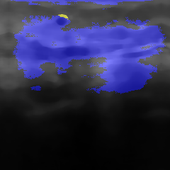
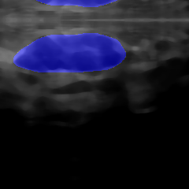

This makes me think that there is definitely a generalization problem
bothering us. This looks like it has to do with the discrepancy in
count of mask pixels vs background pixels. On the initial image
the net overshot the ground truth mask by a considerable margin.
On that image the mask region was really small in comparison to
overall image size. So this looks like a sort of broader
focusing problem.

Let's maybe try to run the training on the same set of images with
focal loss function this time. If that doesn't help we can try to
pivot to something like the Attention U-Net.

Tried focal loss with multiple alpha-gamma combinations.
The length of training was 100 epochs.
The ones that look promising so far:
1. alpha = 0.6, gamma = 0.7;
2. alpha = 0.9, gamma = 2 
3. alpha = 0.9, gamma = 3
4. alpha = 0.99, gamma = 3.5
5. alpha = 0.999, gamma = 4

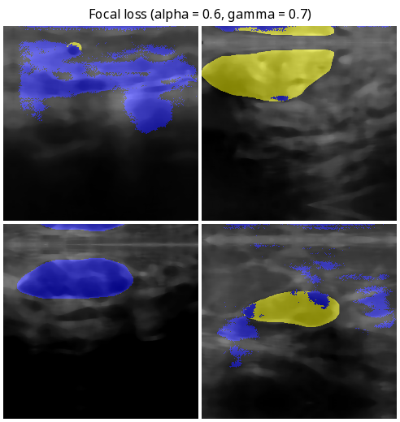
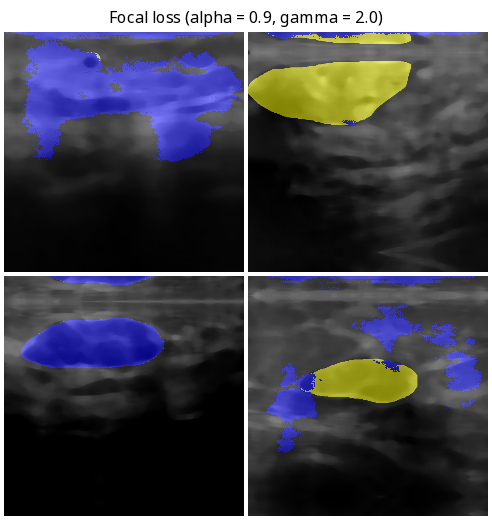
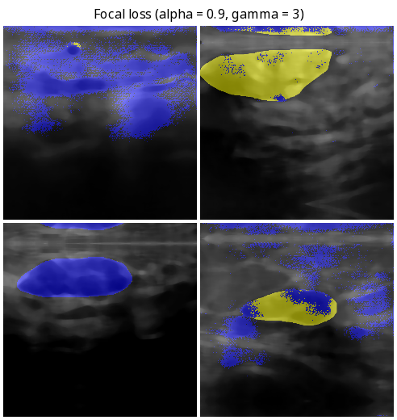
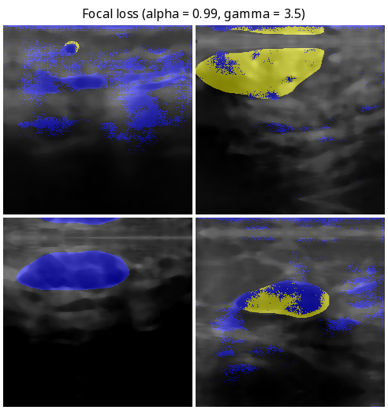
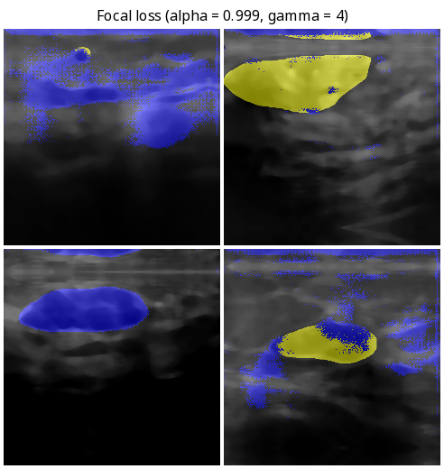

# 2026-01-25

Today I'm experimenting with adding different loss functions to the mix.
Turns out that adding in BCE actually degrades the training quality.
I've tried two different proportions: 70% focal + 30% BCE and 80% focal + 20% BCE.

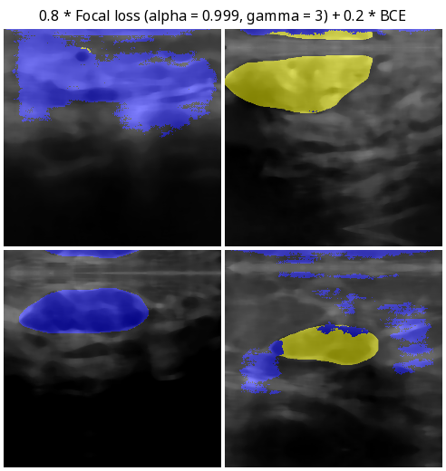

I also managed to try adding continuous DICE to the mix. It didin't help.
It actually peformed slightly worse than focal alone on the example with
the smallest tumor.

A thought came to my mind that displaying the network's output as a probability
map with different colours representing different probabilities might be also
helpful for debugging.
I tried that and the prediction don't really look that different.
Only the areas that were depicted in blue before have noticably higher
probabilities than the rest of the image.

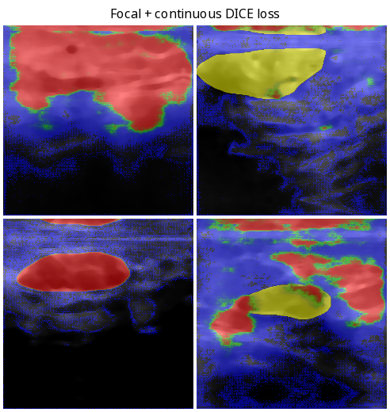

Next I would like try whether adding Tversky loss to the mix could help.

# 2026-01-27

Remember how some time ago I started suspecting that the model might actually learn
only from the initial image in the dataset and ignore all other images? When trying out
Tversky loss I regenerated the dataset and I observed that the only image which was
properly segmented occupies the same place in the grid as the sole good prediction
in all the grids I've generated before. Just to be sure I regenerated the dataset
once again and the same pattern appeared. What's following are predictions made
using the Tversky loss with alpha = 0.85 and beta = 0.15 on two different datasets.

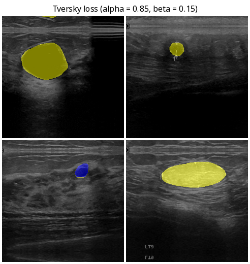
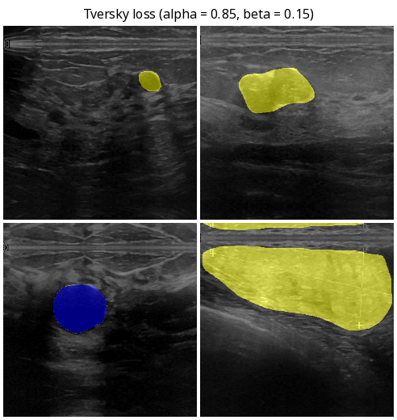

I have no idea why this is happening. This is actually a little bittersweet since
this means the model is actually learning but the model "locks" somehow after it
learns only one label. I have a suspicion that tinygrad's JIT somehow locks the
arguments of the training function in place after the training gets to the second
image in the set. Will try to train once without JIT and see whether the output
will be different.

# 2026-02-05
The model trained without JIT performed way better than the one we've seen in [[27-01]].
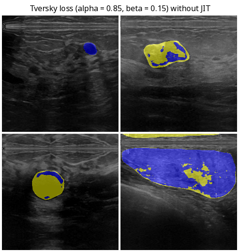
So now we should figure out what's causing the training routine to get stuck on one picture.

I tried to do some adjustments
(mainly creating a tensor and putting different indexes to it and passing it to `training_step`)
but it didn't work. Tomorrow I will try some other ways to fix this.

# 2026-02-07
I managed to fix the problem with JIT. I modified the training function so that it now
takes two parameters which are the image and label tensors instead of taking the index
and choosing the image and label inside the function.

The output from the net trained by the jitted training function is now the same as
the one trained on a non-jitted function. The outputs aren't yet perfect but I
can finally see a path to success. I will try to adjust the hyperparameters and
see whether this helps.
now a 
